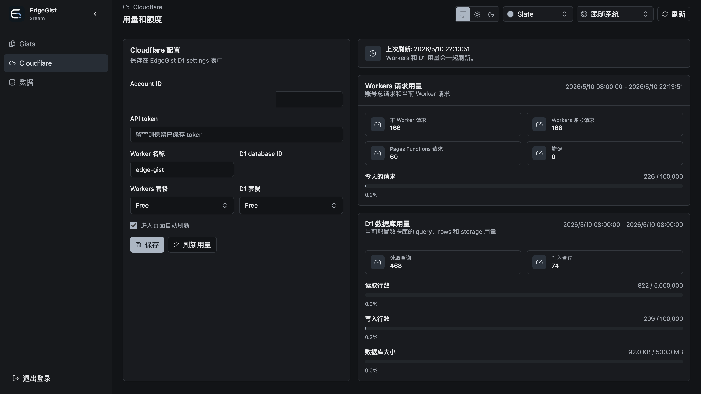

# EdgeGist

<p align="center">
  <picture>
    <source media="(prefers-color-scheme: dark)" srcset="public/icons/edgegist-dark-192.png">
    
  </picture>
</p>

[简体中文](README.zh-CN.md)

Minimal GitHub Gist-compatible API service running on Cloudflare's edge network, backed by D1 and deployed on Cloudflare Workers with static assets.

Works perfectly with the [Sub-Store](https://github.com/sub-store-org/Sub-Store) Gist sharing and backup features.

EdgeGist is API-first: deploy it, configure your owner token, and point Gist API clients at your own base URL instead of `https://api.github.com`. It also ships a single-owner Web UI at `/<owner>` for browsing, editing, import/export, and Cloudflare usage checks. The root path `/` intentionally returns `404` instead of redirecting, so the configured owner route is not exposed.

## Community

Join the community for discussion and updates.

👥 Group [折腾啥](https://t.me/zhetengsha_group) · 📢 Channel [折腾啥](https://t.me/zhetengsha)

## Screenshots

The Web UI supports English and Simplified Chinese. The screenshots below use Simplified Chinese so the project only needs to maintain one screenshot set.

<table>
  <tr>
    <td width="50%" valign="top" align="center">
      
      <br>
      <sub>Server-side search across ids, descriptions, filenames, and file contents, with filters, sorting, pagination, stars, and syntax-highlighted content matches.</sub>
    </td>
    <td width="50%" valign="top" align="center">
      
      <br>
      <sub>Responsive gist detail dashboard with a file tree, syntax-highlighted content, file history, file-set changes, and configurable diffs.</sub>
    </td>
  </tr>
  <tr>
    <td width="50%" valign="top" align="center">
      
      <br>
      <sub>Diff view with current and revision raw URLs, automatic/split/unified/stacked layouts, inline-change modes, line wrapping, line numbers, backgrounds, and collapsible unchanged lines.</sub>
    </td>
    <td width="50%" valign="top" align="center">
      
      <br>
      <sub>Cached and refreshable Cloudflare Workers request, D1 row, and D1 storage usage.</sub>
    </td>
  </tr>
  <tr>
    <td width="50%" valign="top" align="center">
      
      <br>
      <sub>Owner login with username/password, optional remember-me, and optional Cloudflare Turnstile.</sub>
    </td>
    <td width="50%" valign="top"></td>
  </tr>
</table>

## Current Scope

- GitHub Gist-shaped API for core gist CRUD and retained revisions.
- Single-owner authentication: bearer token for API clients, password + optional Turnstile + signed cookie for the Web UI.
- Public and secret-link visibility handling. Secret gists are hidden from anonymous list APIs but remain readable by direct URL; retained revisions follow the current gist visibility.
- D1-backed current files, retained history snapshots, and settings.
- Latest-N history retention for each file and each gist's file-change feed.
- GitHub Gist-style Web UI at `/<owner>`, `/<owner>/new`, `/<owner>/<gist_id>`, and `/<owner>/<gist_id>/<sha>` with anonymous public browsing, owner management, gist editing, file history, diff view, stars, import/export, i18n, themes, PWA install support, and Cloudflare usage/quota views.
- Root `/` returns `404` and does not redirect to the owner route. Anonymous users need to know `/<owner>` to browse public gists.
- Real single-owner star support; fork and comment surfaces remain compatibility mocks with zero social data.
- Release packaging for Cloudflare Workers, including prebuilt Worker assets.

Not in the first implementation: git repository transport, multi-user collaboration, and real social features.

## API Behavior Notes

- Owner API clients should send `Authorization: Bearer <EDGEGIST_OWNER_TOKEN>`.
- Anonymous list APIs return `public` gists only. `secret` gists are omitted from anonymous lists but can still be read anonymously when the caller knows the URL or gist id.
- Retained revisions do not have separate visibility. If the current gist is readable by direct URL, its retained revisions are readable by direct URL.
- `PATCH /gists/{gist_id}` treats `null`, empty content, and an empty file spec as file deletion. Deleting every file deletes the gist.
- Raw file endpoints serve content as `text/plain` with `nosniff`, so HTML gist files are shown as inert text.

## Development

Requirements: Bun and Node.js 22 or newer. This repository includes `.node-version` because Wrangler requires a modern Node runtime. If you use mise, run `mise install` once and your shell will pick up the project Node version automatically when you enter the repository.

```sh
bun install
bun run dev
```

`bun run dev` prepares the local environment, applies local D1 migrations, and starts the API at `http://127.0.0.1:8787/` and the Web UI at `http://127.0.0.1:8787/<owner>`. Root `/` returns `404` by design.

On first run it will:

- create `wrangler.jsonc` from `wrangler.example.jsonc` when missing;
- create or append `.dev.vars` with local development defaults;
- set `EDGEGIST_BASE_URL` to `http://127.0.0.1:8787`;
- skip Turnstile on localhost/loopback dev hosts even if Turnstile keys are configured;
- persist local D1 data under `.wrangler/state/v3`.

Useful development commands:

```sh
bun run dev:prepare
bun run dev:server
bun run test
bun run build
```

Use `bun run dev:prepare` when you only want to create local config and apply local D1 migrations. Use `bun run dev:server` when local D1 is already prepared and you only want to restart the server. `bun run build` creates the client assets, Worker script, and Workers Assets ignore file under `dist/`.

If you used an older development build before the schema stabilized and local D1 starts failing, delete `.wrangler/state/v3` and run `bun run dev:prepare` again. EdgeGist keeps source migrations clean for new installs and does not carry compatibility migrations for stale development data.

## Configuration

`wrangler.jsonc` is the deployment source of truth. Copy `wrangler.example.jsonc` to `wrangler.jsonc` and fill in the project-specific values. Do not commit `wrangler.jsonc` when it contains real credentials or account-specific IDs.

### Worker and asset fields

| Field | Required | Value |
| --- | --- | --- |
| `name` | Yes | Worker script name. For this deployment it is usually `edge-gist`. The Usage page's `Worker name` field should match this value when you want script-level request usage. |
| `compatibility_date` | Yes | Cloudflare Workers compatibility date. Keep the example value unless you intentionally update runtime behavior. |
| `main` | Yes | `./dist/_worker.js`. The build outputs the Worker script here. |
| `assets.directory` | Yes | `./dist`. Static files are uploaded as Workers Assets from this directory. |
| `assets.binding` | Yes for this project | `ASSETS`. Keep the binding name unless the Worker code is changed to use a different assets binding. |

The build copies `.assetsignore` into `dist` so `_worker.js` is not served as a static asset.

### Application variables in `vars`

| Field | Required | Value |
| --- | --- | --- |
| `EDGEGIST_OWNER_USERNAME` | Yes | Owner login username. |
| `EDGEGIST_OWNER_PASSWORD` | Yes | Owner login password. |
| `EDGEGIST_OWNER_TOKEN` | Yes | Owner access token for API/client operations. Keep it secret. |
| `EDGEGIST_BASE_URL` | Yes | Public origin with protocol, for example `https://edge-gist.sbfm.eu.org`. Use the final Workers custom domain, not a Pages URL. |
| `EDGEGIST_HISTORY_MAX_VERSIONS` | Optional | Number of retained history entries per file and file-change records per gist. Defaults to `100`. |
| `EDGEGIST_TURNSTILE_SITE_KEY` | Optional | Cloudflare Turnstile site key. Leave blank to disable Turnstile. |
| `EDGEGIST_TURNSTILE_SECRET_KEY` | Optional | Cloudflare Turnstile secret key. Required only when the site key is set. |

Local development can use `.dev.vars`. Production reads values from `wrangler.jsonc` `vars` during deploy.

### D1 binding in `d1_databases`

| Field | Required | Value |
| --- | --- | --- |
| `binding` | Yes | Must be `DB`. The backend reads the database from `c.env.DB`. |
| `database_name` | Yes | D1 database display name, usually `edge-gist`. |
| `database_id` | Yes | D1 database UUID from `wrangler d1 create` or the Cloudflare dashboard. This is an ID, not the database name. |

Use the same D1 database UUID in the app's Cloudflare Usage settings when you want D1 usage and quota data.

### Custom domain

A custom domain can be attached in either place:

1. In `wrangler.jsonc` before deploy:

```jsonc
{
  "routes": [
    { "pattern": "edge-gist.sbfm.eu.org", "custom_domain": true }
  ]
}
```

2. Manually in the Cloudflare dashboard: Workers & Pages -> select the Worker -> Settings -> Domains & Routes -> Add -> Custom Domain.

Cloudflare requires the hostname to be in a Cloudflare zone you control. If Wrangler fails to create the custom domain because of DNS or token permissions, deploy the Worker first, then attach the domain manually in the dashboard.

No KV, R2, Queues, or Workers Sites configuration is required for this project.
## Command-Line Deployment

This project deploys to Cloudflare Workers with Workers Assets. Use `wrangler deploy`; do not use `wrangler pages deploy`.

### Fresh deployment

Prerequisites: Bun, Node.js compatible with this project, Wrangler 4+, and access to the target Cloudflare account.

1. Install dependencies:

```bash
bun install
```

2. Create the D1 database and record the returned UUID:

```bash
bun run db:create
```

3. Create the production Wrangler config:

```bash
cp wrangler.example.jsonc wrangler.jsonc
```

4. Edit `wrangler.jsonc`:

| Area | What to set |
| --- | --- |
| Worker | `name`, normally `edge-gist`. |
| Owner auth | `EDGEGIST_OWNER_USERNAME`, `EDGEGIST_OWNER_PASSWORD`, and `EDGEGIST_OWNER_TOKEN`. |
| Public URL | `EDGEGIST_BASE_URL`, for example `https://edge-gist.sbfm.eu.org`. |
| D1 | `d1_databases[0].database_id` with the D1 UUID. Keep `binding` as `DB`. |
| Custom domain | Optional `routes` entry with `{ "pattern": "your-domain.example.com", "custom_domain": true }`. |
| Turnstile | Optional site key and secret key. Set both or leave both blank. |

5. Apply database migrations to the remote D1 database:

```bash
bun run db:migrate:remote
```

6. Build the Worker and static assets:

```bash
bun run build
```

7. Deploy:

```bash
bun run deploy
```

If you are not logged in with Wrangler, provide a token for this command only:

```bash
CLOUDFLARE_API_TOKEN=<token> bun run deploy
```

8. If you did not configure `routes`, attach the custom domain manually in the Cloudflare dashboard. After the domain is active, make sure `EDGEGIST_BASE_URL` matches that URL and redeploy if you changed it.

### Manual Cloudflare Workers deployment from a release package

Use this path when you download `edgegist-package.zip` and do not want to build locally.

1. Unzip `edgegist-package.zip`.
2. Create or select a D1 database in Cloudflare.
3. Run the SQL files in `migrations/` against that D1 database, in filename order.
4. Copy `wrangler.example.jsonc` to `wrangler.jsonc` inside the extracted package.
5. Fill in the same fields described in the Configuration section: owner auth, `EDGEGIST_BASE_URL`, D1 `database_id`, optional Turnstile, and optional `routes`.
6. Deploy with Wrangler 4+:

```bash
wrangler deploy
```

Or, without a globally installed Wrangler:

```bash
npx wrangler@^4 deploy
```

The release package already contains `dist/_worker.js` and static assets, so no build command is required.

### Manual Cloudflare dashboard steps

Some operations are intentionally manual or account-specific:

| Operation | Where |
| --- | --- |
| Create API tokens | Cloudflare dashboard -> My Profile -> API Tokens. |
| Create D1 database | Cloudflare dashboard -> Workers & Pages -> D1, or `bun run db:create`. |
| Apply migrations manually | Cloudflare dashboard -> D1 -> database -> Console. |
| Attach custom domain | Cloudflare dashboard -> Workers & Pages -> Worker -> Settings -> Domains & Routes. |
| Configure Usage page fields | Edge Gist app -> Settings -> Cloudflare Usage. |
## Usage And Quota

The Cloudflare Usage page is configured from the app UI and stored in D1. These fields are not deployment variables in `wrangler.jsonc`.

### Required Cloudflare fields in the app

| UI field | Required | Value |
| --- | --- | --- |
| `Account ID` | Yes | Cloudflare account ID that owns the Worker and D1 database. |
| `API token` | Yes | Cloudflare API token used only for reading usage data. Required permissions are `Account Analytics Read` and `D1 Read`. |
| `Worker name` | Optional for account total, required for current-Worker usage | Worker script name, usually the `name` from `wrangler.jsonc`, for example `edge-gist`. If blank or wrong, account total usage can still load, but the `This Worker requests` value will be unavailable or zero. |
| `D1 database ID` | Yes for D1 usage | D1 database UUID. The database name is not accepted here. |
| `Workers plan` | Yes | Select `Free` or `Paid` so the UI can use the correct Workers request quota. |
| `D1 plan` | Yes | Select `Free` or `Paid` so the UI can use the correct D1 row/storage quotas. |

### What the Usage page shows

| Section | Meaning |
| --- | --- |
| Workers requests | Account-level Workers request quota usage for the displayed usage window. The total includes Workers script invocations and legacy Pages Functions invocations when Cloudflare reports them, because Cloudflare's quota dashboard can include both. |
| This Worker requests | Requests for the configured `Worker name` only. This is useful for seeing how much of the account total came from this app. |
| Workers account requests | Account-level Workers script invocations. |
| Pages Functions requests | Legacy Pages Functions requests, shown only when Cloudflare reports a non-zero value. |
| Errors | Combined error count for the Workers/Pages Functions usage window. |
| D1 database usage | Read queries, write queries, rows read, rows written, and database size for the configured D1 database ID. |

Usage windows are displayed with the browser's `toLocaleString()` formatting. The Usage page caches the last successful response in D1 so the dashboard can still show recent data if Cloudflare's API is temporarily unavailable.

Cloudflare analytics can lag behind real time. Small differences from the Cloudflare dashboard are expected when the dashboard and the app use slightly different aggregation windows or when Cloudflare has not finished processing the latest data.
## Updating

### Git-based deployment

1. Pull the latest source.
2. Run `bun install` if dependencies changed.
3. Review `wrangler.example.jsonc` for newly added fields and copy them into your private `wrangler.jsonc` without overwriting real credentials or IDs.
4. Run any new D1 migrations with `bun run db:migrate:remote`.
5. Run `bun run build`.
6. Deploy with `bun run deploy`.

### Release-package deployment

1. Download and unzip the latest `edgegist-package.zip`.
2. Copy your existing `wrangler.jsonc` into the extracted package.
3. Review `wrangler.example.jsonc` for newly added fields and add missing values to your copied config.
4. Run any new SQL files in `migrations/` against your D1 database.
5. Deploy with `wrangler deploy` or `npx wrangler@^4 deploy`.

After updates that touch Cloudflare usage, open Settings -> Cloudflare Usage and confirm the saved `Account ID`, `Worker name`, `D1 database ID`, and plan selections still match your Cloudflare account.

## Cloudflare Account API Token For Deployment

For local or CI deployment with `CLOUDFLARE_API_TOKEN`, create a Cloudflare API token scoped to the target account.

Minimum permissions for the deploy flow:

| Permission | Why |
| --- | --- |
| `Workers Scripts Edit` | Upload and update the Worker script and assets with `wrangler deploy`. |
| `D1 Edit` | Create D1 databases and apply remote D1 migrations when using Wrangler commands. |

If the same token is also used in the app's Cloudflare Usage settings, add:

| Permission | Why |
| --- | --- |
| `Account Analytics Read` | Read Workers and D1 analytics through Cloudflare GraphQL. |
| `D1 Read` | Read D1 database metadata, including database size. |

For custom domains configured through `routes`, the token must also be allowed to operate on the Cloudflare zone that owns the hostname. If that fails, deploy the Worker without `routes` and add the custom domain manually in the Cloudflare dashboard.

Recommended CI secrets:

| Secret | Value |
| --- | --- |
| `CLOUDFLARE_API_TOKEN` | Deployment token. |
| `CLOUDFLARE_ACCOUNT_ID` | Target Cloudflare account ID. |

Do not put Cloudflare API tokens in `wrangler.jsonc`, README files, or committed source files.
## GitHub Releases

Bump `package.json` version and merge or push that change to the default branch to cut a release. The Release workflow can also be run manually from GitHub Actions.

The workflow reads `package.json` for the package name and version, uses `v${version}` as the release tag, fails if that release already exists or if the tag points at a different commit, then runs tests, builds, packages, generates conventional release notes, creates the tag when needed, and publishes:

- `edgegist-package.zip`: README files, migrations, example config, prebuilt Worker script, and static assets.
- `SHA256SUMS`: checksums for release assets.

## API Compatibility

Supported GitHub Gist-compatible REST surface:

- `GET /gists`, `GET /gists/public`, and `GET /users/{username}/gists`.
- `POST /gists`, `GET /gists/{gist_id}`, `PATCH /gists/{gist_id}`, and `DELETE /gists/{gist_id}`.
- `GET /gists/{gist_id}/commits` and `GET /gists/{gist_id}/{sha}` for retained file revisions.
- Current raw files through `GET /gists/{gist_id}/raw/{filename}` and GitHub-style `GET /{owner}/{gist_id}/raw/{filename}`.
- Retained raw files through `GET /gists/{gist_id}/raw/{sha}/{filename}` and GitHub-style `GET /{owner}/{gist_id}/raw/{sha}/{filename}`.
- Star endpoints: `GET /gists/starred`, `GET /gists/{gist_id}/star`, `PUT /gists/{gist_id}/star`, and `DELETE /gists/{gist_id}/star`.

Compatibility mocks:

- `GET /gists/{gist_id}/comments`, comment mutation endpoints, and fork endpoints exist for client compatibility, but return empty or no-op responses.

Unsupported:

- Git transport (`git clone`, `git push`, `git pull` against a gist repository) is not implemented.

## Related Projects

- [LiteGist](https://github.com/lockcp/LiteGist)

  > LiteGist is an extremely lightweight, experience-focused personal standalone pastebin service. Designed with a full-screen editor philosophy, it supports Markdown rendering, code highlighting, password protection, Gist-compatible multi-file management, and PWA support. It aims to provide you with a high-performance "Private Gist" sharing experience.
